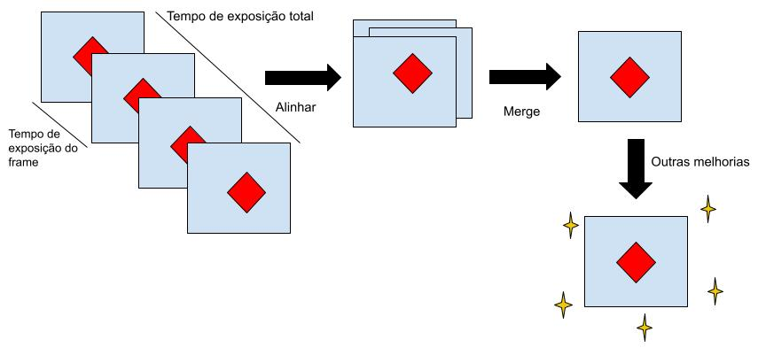
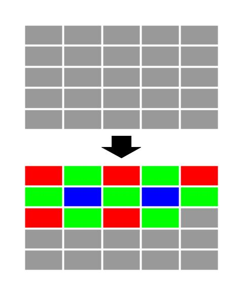

# `Fotografia Digital de Celulares`
# `Mobile Digital Photography`

## Apresentação

O presente projeto foi originado no contexto das atividades da disciplina de pós-graduação *EA979A - Introdução a Computação Gráfica e Processamento de Imagens*, 
oferecida no primeiro semestre de 2022, na Unicamp, sob supervisão da Profa. Dra. Paula Dornhofer Paro Costa, do Departamento de Engenharia de Computação e Automação (DCA) da Faculdade de Engenharia Elétrica e de Computação (FEEC).

> |Nome  | RA | Curso|
> |--|--|--|
> | Amanda Camila Gonçalves Ramos  | 193677  | Física Médica|
> | Mariana Sartorato Jorge  | 241334  | Eng. de Computação|

## Resumo

Nesse projeto discutiremos o processo que envolve a fotografia digital em aparelhos móveis (com ênfase em celulares) de forma a entender como funciona o pipeline grafico e os processos envolvidos, incluindo a compressão de dados e processamentos de imagem. Para isso utilizaremos como base alguns artigos e publicações sobre o tema, enfatizando a parte teórica de todo esse processo.

## Descrição do Problema/Motivação

Ao capturar uma foto, vários dados são coletados. Para esses dados se transformarem em uma imagem `.png` ou `.jpeg`, é necessário selecionar algumas informações e compactar a imagem. Atualmente, a grande maioria dos celulares e câmeras digitais faz essa compactação automaticamente e a grande maioria das pessoas não sabe que isso acontece. Como acreditamos que esse é um processo muito importante e que se encontra presente no nosso dia a dia, achamos relevante entender como ele funciona. Com isso em mente, iremos estudar o processo de captura de imagens feitas por celular, inclusive a forma com que são salvas, se já existe algum tipo de compressão, incluindo o processo que possa estar envolvido no hardware.

## Objetivo

Estudo sobre os processos envolvidos entre a captura de imagens em celulares e seu salvamento no aparelho, com uma abordagem mais teórica dos mecanismos envolvidos, sejam eles em software ou hardware.

## Discussão

## Processo moderno multi-frame

Nos últimos tempos, com a evolução dos *smartphones* e da qualidade da rede de internet, houve também a 
evolução das câmeras digitais: é possível gravar vídeos e tirar fotos de altíssima qualidade com apenas 
um aparelho celular. Um conceito fundamental no deselvolvimento das câmeras foi o de capturar e juntar 
vários frames, ao invés de capturar somente uma imagem, em busca de melhorar sua qualidade.

### Sensor da câmera

O sensor de uma câmera digital é composto por uma grade 2D de fotodiodos, responsáveis por converter fótons
em carga elétrica. Normalmente, cada fotodiodo corresponde a um pixel da imagem. Para criar imagens coloridas,
é necessário utilizar filtros de cores. Geralmente, esses filtros permitem que somente uma das três cores do 
grupo RGB sejam capturadas. O filtro mais comum é a matriz CFA, também conhecida como filtro de Bayer.

### Controle de exposição

Exposição é a quantidade de luz que o sensor da câmera recebe. É de fundamental importância que 
isso seja bem regulado, já que pode gerar ruído, fazer com que a imagem fique borrada, entre outros.
O ajuste da exposição pode ser feito pela combinação da abertura da lente, ISO (ganho do sensor) e o
tempo de exposição. Contudo, como os celulares tem uma abertura de lente fixa, o controle geralmente é
feito através do tempo de exposição e do ganho do sensor, que podem ser controlados manualmente ou 
serem usados com a configuração padrão automaticamente.

### Alinhamento 

Consiste no processo de alinhar corretamente os diversos frames obtidos, em busca de obter uma
imagem de alta qualidade. Procura encontrar uma correspondência entre um frame de referência com
os outros frames. Existem várias técnicas para que isso aconteça. Várias delas, pelo menos as de 
maior eficiência, têm um alto custo computacional e demoram um tempo significativo para seremm 
executadas. Um método de alinhamento é o `Multi-scale Pyramid Alignment`. 

Para esse método, é feito um alinhamento com pirâmedes de Gauss de quatro níveis, indo do alinhamento
mais grosseiro a um mais refinado. Isto é, a imagem é dividida em um certo número de quadrados em cada
iteração. Para a base da pirâmede, é usado um palpite. Depois disso, é utilizada uma fórmula usando a 
imagem de referência e a um outro frame:

$$ D_p(u,v)=\sum_{y=0}^{n-1} \sum_{x=0}^{n-1} |T(x,y)-I(x+u+u_0, y+v+v_0)|^p $$

onde T é o quadrado de referência de tamanho *n x n*, *(u, v)* é o possível local em que o quadrado se
 encontra na segunda imagem, *I* é uma área maior na imagem alternativa, *p* é a potência da normal 
 usada e *$(u_0, v_0)$* é o palpite inicial da área.    

### *Merge*

Faz com que os vários frames capturados se tornem um só. HDR+ foi um dos primeiros processos a serem 
distribuídos comercialmente em larga escala. Ele mesclava, a partir de um frame de referência, a imagem
mais nítida entre as três primeiras imagens capturadas, pares de frames e os interpolava. 
Para isso, é utilizada uma expressão no domínio temporal com um filtro que permite controlar o peso que 
cada frame terá no produto final:

$$ T_0'(w) = (1/N) * \sum_{z=0}^{n-1} T_z(w) + A_z(w) * [T_0(w) - T_z(w)] $$

que pode ser reescrito como:

$$ T_0'(w) = (1/N) * \sum_{z=0}^{n-1} (1-A_z)*T_z(w) + A_z(w) * T_0(w) $$

e

$$ A_z (w) = (|D_z(w)|²) / (|D_z(w)|² + c * a²), $$

onde  $ D_z(w) = T_0(w) - T_z(w)$ e $a²$ é a variação do ruído fornecido pelo modelo
de ruído.

O peso da interpolação dependia da quantidade de ruído esperada e a diferença entre os pares, dando um 
peso maior a referência quando a diferença entre eles era muito grande e um peso maior a mescla quando 
o ruído esperado era maior que a diferença. O produto final é um frame com filtro de Bayer e um bit de
profundidade maior do que o esperado caso só um frame fosse capturado. 

### Finalização de fotografia: Redução de ruído, mapeamento tonal e nitidez.
  Ainda que fotografia com múltiplos frames tenha melhorado significativamente a qualidade das imagens resultantes, ainda precisamos de algumas operações adicionais para chegarmos à qualidade desejada nas fotografias. Essas operações são o núcleo do processamento de imagens tradicional, técnicas de melhoramento têm sido estudadas exaustivamente nas últimas décadas. Para imagens com múltiplos frames, a finalização deve ser especialmente pensada na forma que queremos na saída.

#### Diminuição de Ruído
  A filtragem da imagem é um passo muito importante durante o pipeline computacional da fotografia, e para isso a operação canônica de filtragem mais usada é aquela que irá suavizar a imagem, atenuando o efeito do ruído.
Durante os últimos 50 anos, houveram muitas abordagens de filtragem, começando com as mais simples, como simples filtros de média. Essa necessidade de filtragem se tornou mais evidente pois com a diminuição do tamanho dos aparelhos e o aumento do número de pixels por unidade de área do sensor, as câmeras modernas de celulares tiveram uma maior propensão ao ruído, o que fez com que a indústria gastasse mais tempo tentando contornar esse problema.
Recentemente, nos últimos dez anos aproximadamente, que houve um desenvolvimento mais robusto na questão de redução de ruídos. O que iniciou esse progresso são os modelos baseados em correções (patch-based), esse tipo de algoritmo busca trechos onde há redundâncias ou autossimilaridades na imagem. Esses trechos carregam informações que serão usadas para comparar regiões similares e fazer uma varredura de tal forma que consiga reduzir valores que parecem não ser tão similares aos valores do que a imagem deveria ter, dessa forma, reduzindo o ruído.
Uma forma genérica de construir filtros para reduzir ruídos é usar um kernel no seguinte formato: $ k_{ij}(y)= K(y_i, y_j) $, onde y é a imagem com ruído e $y_i$ e $y_j$ são as localizações dos pixels. Especificamente, temos
$$ w_{ij} = \frac{k_{ij}}{\sum k_{ij} }$$
Cada pixel da imagem reduzida de ruído é dado por
$$ Y_j= \sum_{i=1}^n w_{ij} y_(i) $$
Onde os coeficientes $[a_{1j}, ... , a_{nj}]$ descrevem a a contribuição relativa dos pixels de entrada com  os de saída, de forma que sua soma seja igual a 1.
Existem alguns tipos de filtros que são bastante utilizados em diversas áreas que envolvem imagens, incluindo a fotografia, cada um com seu kernel bastante específico.

#### Filtros gaussianos clássicos:
É aquele que usa a medida de distância espacial entre dois pixels localizados em $x_i$ e $x_j$, o kernel clássico gaussiano pode ser escrito como:
$$ k_{ij} = exp(\frac{-\||(x_i – x_j)\||^2}{h^2})$$
Esse tipo de kernel aplica o mesmo peso na filtragem independentemente do tipo de pixel sendo utilizado.

#### Filtro bilateral:
Esse filtro leva em conta tanto a distância espacial quanto a distância em termo de dados entre duas amostras
$$ k_{ij} = exp\left(\frac{-\||(x_i – x_j)\||^2}{h_{x}^2}\right) exp\left(\frac{-(y_i – y_j)^2}{h_{y}^2}\right) = exp\left(\frac{-\||(x_i – x_j)\||^2}{h_{x}^2}+\frac{-(y_i – y_j)^2}{h_{y}^2}\right) $$

No lado direito da equação, podemos observar que a métrica utilizada é uma ponderação de distância euclidiana entre os vetores $(x_i, y_i)(x_j, y_j)$. Esse tipo de kernel é fácil de ser calculado computacionalmente e produz uma certa adaptabilidade local em relação aos pixels.

#### Médias não locais 
Esse tipo de algoritmo é uma generalização do filtro bilateral, onde o termo dependente de dados é medido em blocos, ao invés de simplesmente pontos, e segue o seguinte formato
$$k_{ij} = exp\left(\frac{-\||(x_i – x_j)\||^2}{h_{x}^2}\right) exp\left(\frac{-\||(y_i – y_j)\||^2}{h_{y}^2}\right)$$
Com $y_i$ e $y_j$ como subconjuntos de pixels em y.

#### Kernel de regressão localmente adaptativa 
A ideia geral desse kernel é a medida da estrutura local de dados utilizando a estimativa da distância geodésica local entre amostras próximas. Sua forma segue:
$$k_{ij} = exp{-(x_i -X_j)^T Q_{ij}(x_i-x_j)}$$
Onde $Q_{ij}$ é a matriz da covariância do gradiente dos valores da amostra estimados dos dados pixels, resultando na aproximação local da distância geodésica no expoente. A dependência de $Q_{ij}$ nos dados mostra que esse filtro segue uma forma não linear e varia no deslocamento.

#### Redutores de ruído contemporâneos:
Nos últimos anos, métodos baseados em redes neurais convolucionais profundas têm se tornado dominantes na qualidade dos resultados obtidos se comparamos com métricas quantitativas bem estabelecidas. Métodos baseados em aprendizado profundo supervisionado são considerados, atualmente, o estado da arte. Vale ressaltar que esses métodos ainda não são práticos para uso do dia-a-dia (principalmente em dispositivos móveis), já que demandam uma computação pesada e muita memória, além de poderem gerar artefatos irrealistas em relação a medidas de percepção visual mais qualitativas.
É importante ressaltar que conforme os métodos de redução de ruído foram evoluindo, de processamentos de sinal/imagem para redes neurais profundas, foi aumentando a necessidade de conjuntos de imagens de treinamento que representam com precisão o ruído que é encontrado nos sensores das pequenas câmeras de celulares. Com isso em mente, dois grupos de dados (datasets DND e SSID) trazem imagens capturadas diretamente de aparelhos dos tipos citados anteriormente para serem utilizados em treinamentos de redes neurais profundas. Ambos os trabalhos (DND e SSID), mostraram que o treinamento utilizando imagens reais melhorou a performance se comparado com o uso de imagens sintetizadas de modelos pré-existentes, o que indica que os modelos de ruídos da literatura precisam ser melhorados para capturar as características de sensores de câmeras pequenas. 

#### Mapeamento tonal:
Essa parte do processo de finalização está relacionada com a manipulação das intensidades da imagem, existem duas formas que isso pode ser feito, são elas localmente e globalmente. Começando pela forma global de mapa tonal, temos uma curva que é aplicada a todos os pixels (podendo ser aplicado um mapa para cada canal de cor, ou apenas um para todos), que pode ser ajustada dependendo do se quer enfatizar. A forma local de mapeamento altera as intensidades de uma forma que varia dependendo da posição espacial na imagem, muito comumente chamados de operadores tonais que atuam em uma certa vizinhança de pixels para ajustar suas intensidades. Esses pois métodos podem ser utilizados juntos, se forma a ter uma camada base com a forma global, e camadas adicionais com os mapas locais, dessa forma trazemos imagens com grande qualidade visual.

#### Ajuste de nitidez:
Nitidez é um dos fatores que mais definem a qualidade de uma fotografia, principalmente quando levamos em conta a percepção visual humana. Existem várias formas de quantificar a nitidez de uma imagem, mas nem sempre tem uma definição clara que correlaciona com o que o nosso sistema visual percebe, isso dificulta a criação de algoritmos que ajustam seus parâmetros para trazer uma melhor qualidade visual com o mínimo de artefatos.
Uma imagem pode ficar borrada por diversos motivos, tais como: falta de ajuste de foco, movimento da cena ou da câmera, limitações físicas do aparelho, entre outros. Existem duas abordagens conceitualmente diferentes que buscam melhorar a qualidade da imagem e reduzir as suavizações de borda. O primeiro deles se refere a algoritmos que buscam o melhoramento de borda, que atuam diretamente no aumento das faixas de alta e média frequência na imagem, de forma que, mais comumente, melhorem o contraste de borda. A segunda forma é um pouco mais sofisticada, por assim dizer, já que está baseada em um método de deconvolução, que tenta estimar um kernel de suavização na imagem e tenta invertê-lo para trazer de volta a definição de bordas. 
Um dos algoritmos mais populares e simples de melhora de nitidez é o de mascaramento suavizado, que funciona da seguinte forma: primeiro se faz uma cópia da imagem e a deixa ainda mais borrada, então, subtrai-se esta da imagem original, criando uma imagem residual que contêm detalhes, que se adicionada de volta a imagem original, traz um resultado de aumento das regiões de alta frequência.

## Conclusão

 Com nossos estudos pudemos entender melhor o funcionamento de câmeras digitais de celulares, e pudemos ver também como têm se evoluído os algoritmos de processamento de imagem com o passar dos anos e quais os possíveis caminhos que estes podem seguir. Foi interessante também ver como o processo do pipeline gráfico, embora um pouco longo, é executado tão rápido, quase instantaneamente. Pensando no futuro, seria muito interessante ver essas novas tecnologias, processamentos mais sofisticados, serem aplicados a aparelhos do dia-a-dia, além de novos desenvolvimentos da área.

## Referências Bibliográficas
> * Mobile Computational Photography: A Tour, disponível em <https://arxiv.org/abs/2102.09000>
> * Blahnik, Vladan and Schindelbeck, Oliver. "Smartphone imaging technology and its applications" Advanced Optical Technologies, vol. 10, no. 3, 2021, pp. 145-232. <https://doi.org/10.1515/aot-2021-0023>
> * An Analysis and Implementation of the HDR+ Burst Denoising Method <https://hal.archives-ouvertes.fr/hal-03384097/document>
> * Burst photography for high dynamic range and low-light imaging on mobile cameras <https://static.googleusercontent.com/media/hdrplusdata.org/en//hdrplus.pdf>

## Links Interessantes
> * PNG: The Definitive Guide by - Chapter 9. Compression and Filtering, disponível em <http://www.libpng.org/pub/png/book/chapter09.html>
> * Jakaria Ahmad, Md. Mustafijur Rahman Faysal. "Image-Processing Pipeline for Highest Quality Images", disponível em <http://citeseerx.ist.psu.edu/viewdoc/download?doi=10.1.1.193.2451&rep=rep1&type=pdf>
> * <https://www.cambridgeincolour.com/tutorials/camera-sensors.htm>
> * <https://www.digitalcameraworld.com/tutorials/what-is-exposure>
