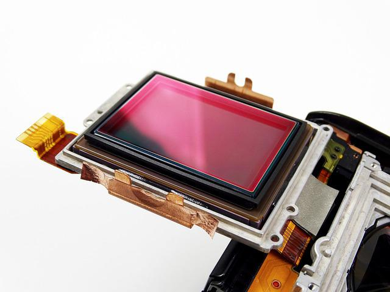

## Processo moderno multi-frame

Nos últimos tempos, com a evolução dos *smartphones* e da qualidade da rede de internet, houve também a 
evolução das câmeras digitais: é possível gravar vídeos e tirar fotos de altíssima qualidade com apenas 
um aparelho celular. Um conceito fundamental no deselvolvimento das câmeras foi o de capturar e juntar 
vários frames, ao invés de capturar somente uma imagem, em busca de melhorar sua qualidade.

### Sensor da câmera

O sensor de uma câmera digital é composto por uma grade 2D de fotodiodos, responsáveis por converter fótons
em carga elétrica. Normalmente, cada fotodiodo corresponde a um pixel da imagem. Para criar imagens coloridas,
é necessário utilizar filtros de cores. Geralmente, esses filtros permitem que somente uma das três cores do 
grupo RGB sejam capturadas. O filtro mais comum é a matriz CFA, também conhecida como filtro de Bayer.

### Controle de exposição

Exposição é a quantidade de luz que o sensor da câmera recebe. É de fundamental importância que 
isso seja bem regulado, já que pode gerar ruído, fazer com que a imagem fique borrada, entre outros.
O ajuste da exposição pode ser feito pela combinação da abertura da lente, ISO (ganho do sensor) e o
tempo de exposição. Contudo, como os celulares tem uma abertura de lente fixa, o controle geralmente é
feito através do tempo de exposição e do ganho do sensor, que podem ser controlados manualmente ou 
serem usados com a configuração padrão automaticamente.

### Alinhamento 

Consiste no processo de alinhar corretamente os diversos frames obtidos, em busca de obter uma
imagem de alta qualidade. Procura encontrar uma correspondência entre um frame de referência com
os outros frames. Existem várias técnicas para que isso aconteça. Várias delas, pelo menos as de 
maior eficiência, têm um alto custo computacional e demoram um tempo significativo para seremm 
executadas. Um método de alinhamento é o `Multi-scale Pyramid Alignment`. 

Para esse método, é feito um alinhamento com pirâmedes de Gauss de quatro níveis, indo do alinhamento
mais grosseiro a um mais refinado. Isto é, a imagem é dividida em um certo número de quadrados em cada
iteração. Para a base da pirâmede, é usado um palpite. Depois disso, é utilizada uma fórmula usando a 
imagem de referência e a um outro frame:

$$

D_p(u,v)=\sum_{y=0}^{n-1} \sum_{x=0}^{n-1} |T(x,y)-I(x+u+u_0, y+v+v_0)|^p

$$

onde T é o quadrado de referência de tamanho *n x n*, *(u, v)* é o possível local em que o quadrado se
 encontra na segunda imagem, *I* é uma área maior na imagem alternativa, *p* é a potência da normal 
 usada e *$(u_0, v_0)$* é o palpite inicial da área.    

### *Merge*

Faz com que os vários frames capturados se tornem um só. HDR+ foi um dos primeiros processos a serem 
distribuídos comercialmente em larga escala. Ele mesclava, a partir de um frame de referência, a imagem
mais nítida entre as três primeiras imagens capturadas, pares de frames e os interpolava. 
Para isso, é utilizada uma expressão no domínio temporal com um filtro que permite controlar o peso que 
cada frame terá no produto final:

$$

T_0'(w) = (1/N) * \sum_{z=0}^{n-1} T_z(w) + A_z(w) * [T_0(w) - T_z(w)]

$$

que pode ser reescrito como:

$$

T_0'(w) = (1/N) * \sum_{z=0}^{n-1} (1-A_z)*T_z(w) + A_z(w) * T_0(w) 

$$

e

$$

A_z (w) = (|D_z(w)|²) / (|D_z(w)|² + c * a²), 

$$

onde 

$D_z(w) = T_0(w) - T_z(w) $ e $ a² $ é a variação do ruído fornecido pelo modelo
de ruído.

O peso da interpolação dependia da quantidade de ruído esperada e a diferença entre os pares, dando um 
peso maior a referência quando a diferença entre eles era muito grande e um peso maior a mescla quando 
o ruído esperado era maior que a diferença. O produto final é um frame com filtro de Bayer e um bit de
profundidade maior do que o esperado caso só um frame fosse capturado. 

## Referências

- https://www.cambridgeincolour.com/tutorials/camera-sensors.htm
- https://www.digitalcameraworld.com/tutorials/what-is-exposure
- https://hal.archives-ouvertes.fr/hal-03384097/document
- https://static.googleusercontent.com/media/hdrplusdata.org/en//hdrplus.pdf
